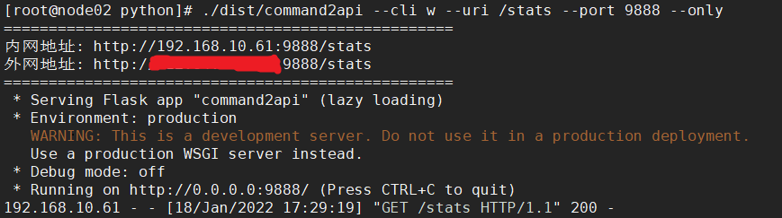
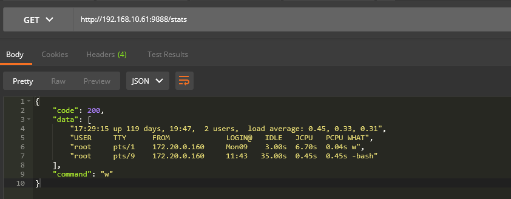

# Command2API
- 实时获取终端命令执行结果，返回JSON格式 - 命令转API

## 使用
```yaml
git clone https://github.com/rexdd/command2api
cd command2api
pip3 install -r requirements.txt
# 实时获取命令最新结果
python3 command2api.py --cli "date" --uri "/stats" --port 8888
# 只执行一次
python3 command2api.py --cli "date" --uri "/stats" --port 8888 --only
```


